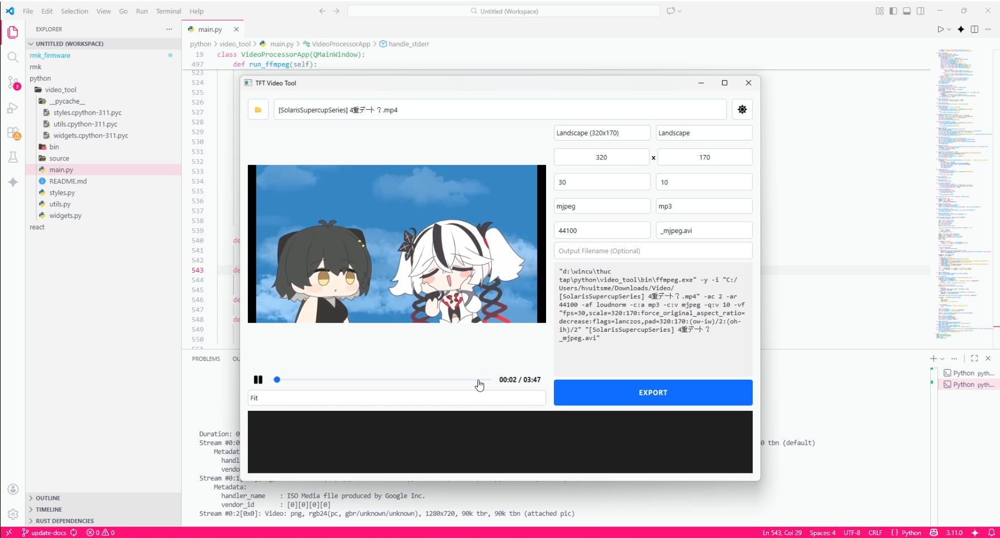

# TFT Video Tool

**TFT Video Tool** is a specialized GUI application built with Python and PySide6 designed to prepare video files for embedded TFT displays (Arduino, ESP32, etc.).

It simplifies the complex process of using FFmpeg for microcontrollers by providing a visual interface to handle resizing, cropping, and codec conversion (MJPEG/Cinepak) specifically optimized for limited-resource hardware.

## New Features in Fork

This fork adds support for the **ESP32-2432S028 "Cheap Yellow Display" (CYD)** and many other improvements:

- **CYD Preset**: Built-in preset for ESP32-2432S028 240x320 displays (ILI9341 TFT)
- **CLI Mode**: Convert videos from command line without GUI
- **Batch Conversion**: Convert all videos in a folder automatically
- **File Size Estimation**: See estimated output size before conversion
- **Windows Executable**: Build standalone .exe for Windows

## Demo

[](source/demo.mp4)

## Key Features

- **Smart Resizing**: Visual tools to **Fit**, **Cover**, or **Stretch** videos to match specific display aspect ratios (e.g., 320x170, 240x280).
- **Embedded Codecs**: One-click conversion to **MJPEG** and **Cinepak** video formats with **PCM** or **MP3** audio.
- **Real-time Preview**: Accurate simulation of the output video before exporting.
- **Themeable UI**: Clean interface with native Dark and Light mode support.
- **FFmpeg Automation**: Automatically generates and executes optimized FFmpeg commands for embedded devices.
- **CYD Support**: Native support for ESP32-2432S028 "Cheap Yellow Display"

## ESP32-2432S028 "Cheap Yellow Display" (CYD)

The ESP32-2432S028 is a popular budget development board with built-in 2.8" TFT display.

### Specifications

| Feature | Specification |
|---------|---------------|
| Display | 2.8" ILI9341 TFT LCD |
| Resolution | 240x320 pixels |
| Interface | SPI |
| Chip | ESP32 (dual-core, 240MHz) |
| Storage | MicroSD card slot |
| USB | USB-C for power/programming |

### TFT Pinout

| Signal | GPIO |
|--------|------|
| TFT_CS | 15 |
| TFT_RST | 4 |
| TFT_DC | 2 |
| TFT_MOSI (SDA) | 23 |
| TFT_SCLK (SCK) | 18 |
| TFT_MISO | 19 |
| SD_CS | 5 |
| BL (Backlight) | 21 |

### ESP32 Sketch Setup

This tool is designed to work with the [thelastoutpostworkshop/esp32-2432S028_video_player](https://github.com/thelastoutpostworkshop/esp32-2432S028_video_player) sketch.

**Libraries to install (via Arduino Library Manager):**
- **GFX Library for Arduino** (Arduino_GFX) by Moon On Our Nation
- **JPEGDEC** by Bitbank2

**Required settings:**
- SPI Speed: 80MHz (or 40MHz if display is unstable)
- Output format: `.mjpeg` (NOT `.avi`)
- SD card folder: `/mjpeg` (create this folder on your SD card)
- Files must have `.mjpeg` extension

**SD Card Setup:**
1. Format SD card as FAT32
2. Create a folder named `mjpeg` (lowercase)
3. Copy your `.mjpeg` files into the `/mjpeg` folder
4. Insert SD card into CYD and power on

**Recommended Settings for this player:**
| Setting | Value |
|---------|-------|
| Resolution | 240x320 |
| FPS | 30 |
| Quality (Q) | 10 |
| Codec | MJPEG |
| Audio | MP3 (44100Hz) |
| Output ext | `.mjpeg` |

## Installation

### Prerequisites

- Python 3.8+
- FFmpeg (included or system PATH)
- PySide6
- qtawesome

### Install Dependencies

```bash
pip install -r requirements.txt
```

### Install FFmpeg

**Windows:**
- Download from https://www.gyan.dev/ffmpeg/builds/
- Extract to `C:\ffmpeg` and add to PATH
- Or place `ffmpeg.exe` in the `bin/` folder

**Linux:**
```bash
sudo apt install ffmpeg
```

**macOS:**
```bash
brew install ffmpeg
```

## Usage

### GUI Mode

```bash
python main.py
```

#### Controls

1. Click **📂** to open a video file
2. Select a **preset** (CYD recommended for ESP32-2432S028)
3. Adjust settings if needed:
   - Width/Height: Output resolution
   - FPS: Frames per second (30 recommended)
   - Q: Quality 1-31 (lower = better, 10 recommended)
   - Codec: MJPEG (recommended) or Cinepak
   - Audio: MP3 or PCM
4. Click **EXPORT** to convert

### CLI Mode

Convert videos directly from command line:

```bash
# Basic conversion
python main.py --cli --input video.mp4 --output out.avi --width 240 --height 320 --fps 30

# With quality setting
python main.py --cli -i video.mp4 -o out.avi -w 240 -h 320 --fps 30 -q 10

# Use a preset
python main.py --cli -i video.mp4 -o out.avi --preset "CYD (ESP32-2432S028) 240x320"
```

#### CLI Options

| Option | Short | Description | Default |
|--------|-------|-------------|---------|
| `--cli` | | Enable CLI mode | (required) |
| `--input` | `-i` | Input video file | (required) |
| `--output` | `-o` | Output video file | (required) |
| `--width` | `-w` | Output width | 240 |
| `--height` | `-h` | Output height | 320 |
| `--fps` | | Frames per second | 30 |
| `--q` | | Quality 1-31 | 10 |
| `--preset` | `-p` | Preset name | custom |

### Batch Conversion

Convert all videos in a folder:

1. Click the **📁** button in the toolbar
2. Select input folder (folder containing videos)
3. Select output folder
4. Click **Start Conversion**

The batch dialog will process all videos in the folder using the current settings.

## Presets

| Preset | Width | Height | FPS | Quality | Codec |
|--------|-------|--------|-----|---------|-------|
| **CYD (ESP32-2432S028)** | 240 | 320 | 30 | 10 | MJPEG |
| Landscape (320x170) | 320 | 170 | 30 | 10 | MJPEG |
| Landscape (280x240) | 280 | 240 | 30 | 10 | MJPEG |
| Portrait (170x320) | 170 | 320 | 30 | 10 | MJPEG |
| Portrait (240x280) | 240 | 280 | 30 | 10 | MJPEG |

## Building Windows Executable

### Prerequisites

```bash
pip install pyinstaller
```

### Build

```bash
python build_exe.py
```

This creates `dist/TFT-Video-Tool.exe`.

### Manual Build

```bash
pyinstaller --name=TFT-Video-Tool \
    --onefile \
    --windowed \
    --add-binary=bin/ffmpeg.exe;bin \
    --add-data=source;source \
    --hidden-import=PySide6 \
    --hidden-import=qtawesome \
    main.py
```

### Output

The executable and supporting files will be in `dist/TFT-Video-Tool/`:

```
dist/TFT-Video-Tool/
├── TFT-Video-Tool.exe   # Main executable
└── bin/
    └── ffmpeg.exe       # FFmpeg binary (if bundled)
```

## File Size Estimation

The tool estimates output file size based on:
- Duration
- Resolution (width × height)
- FPS
- Quality setting
- Audio codec

For a 60-second video at 240x320, 30fps, quality 10 with MP3 audio:
- Estimated size: ~15-25 MB (varies with content complexity)

## Troubleshooting

### "FFmpeg not found"

1. Install FFmpeg (see Installation section)
2. Or place `ffmpeg.exe` in the `bin/` folder
3. On Windows, add FFmpeg to system PATH

### Video playback issues on device

1. Ensure SD card is formatted as FAT32
2. Use MJPEG codec (better compatibility)
3. Lower FPS if playback is choppy
4. Increase quality (lower Q number) if image is blocky

### ESP32 display shows nothing

1. Check wiring matches pinout table
2. Verify TFT_eSPI User_Setup.h configuration
3. Ensure SPI speed is set correctly (40-80MHz)
4. Check power supply (USB-C recommended)

## License

MIT License - See LICENSE file for details.

## Credits

- Original TFT-Video-Tool by hvuitsme
- Built with PySide6 and qtawesome
- FFmpeg for video processing